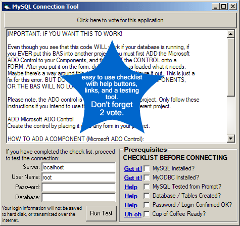

## EASY TO USE MySQL Connection Help and Tool \- BAS Module for Connecting

### Description

To show you how to talk to MySQL easily. This makes it too easy.
 
### More Info
 
Connect to MySQL, Make Queries, Return with Data, if any.

Whatever you have in your database ;)

Brain Damage

Ulsers

Static Discharge

Immune System Malfunctions

Tunnel Syndrome

             |
---                |---
**Submitted On**   |2005-10-20 17:34:08
**By**             |[Nathan A\. Huebner](https://github.com/Planet-Source-Code/PSCIndex/blob/master/ByAuthor/nathan-a-huebner.md)
**Level**          |Advanced
**User Rating**    |4.4 (40 globes from 9 users)
**Compatibility**  |VB 6\.0
**Category**       |[Databases/ Data Access/ DAO/ ADO](https://github.com/Planet-Source-Code/PSCIndex/blob/master/ByCategory/databases-data-access-dao-ado__1-6.md)
**World**          |[Visual Basic](https://github.com/Planet-Source-Code/PSCIndex/blob/master/ByWorld/visual-basic.md)
**Archive File**   |[EASY\_TO\_US19420110202005\.zip](https://github.com/Planet-Source-Code/nathan-a-huebner-easy-to-use-mysql-connection-help-and-tool-bas-module-for-connecting__1-62964/archive/master.zip)

